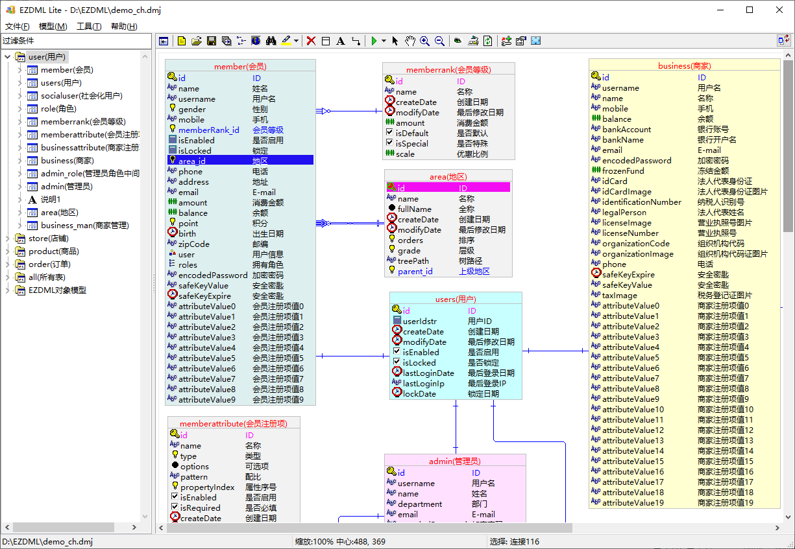

# EZDML Lite

#### 介绍

EZDML Lite是一款国产开源免费跨平台的轻量级数据库建模工具，具有轻巧、快速、简便而功能强大的特点，可轻松地进行数据库表结构设计，建立界面数据模型，生成SQL和自定义代码。

注：本仓库为EZDML的Lite轻量版，包含完整数据库建模功能以及所需要的全部源码，可以在Windows、Linux、MacOS下编译运行。Lite版未包含脚本引擎、界面预览、Excel导入、Pdm导入、ChatGPT生成、批量生成代码和测试数据等扩展功能，如需要编译全功能的版本，可使用EZDML_ord分支。

包含功能：
1. 表结构设计：创建表、字段、主键、外键、索引和注释，界面原型设置：编辑器类型、数据校验、数据生成规则、列显示隐藏等；
2. 表描述：可直接编辑文字描述快速生成表结构，爱用键盘的人会喜欢这个功能；
3. 模型图：自动生成模型图；可设计和显示物理／逻辑视图，支持自动布局、平移、缩小放大等操作；
4. 导入数据库：导入数据库中的已有对象，即所谓的逆向工程，支持ORACLE、MYSQL、SQLSERVER、SQLITE、POSTGRESQL和ODBC、JDBC、HIVE等数据库；
5. 生成数据库：可生成直接创建数据库的SQL脚本；也可与现有数据库或文件比较，然后生成同步脚本的功能，不至于丢失现有数据；
6. 支持达梦（DMOCI或JDBC）、人大金昌（PQ或JDBC）等国产数据库。

官网：http://www.ezdml.com

代码仓库：https://gitee.com/huzgd/ezdml

https://github.com/huzgd/ezdml

#### 开发语言

EZDML即EzDML，是Easy Data Model Language（简易数据模型语言）的意思，大约始于2006-2009年。最开始是用Delphi写，后来转到了lazarus下开发，开发语言为Pascal。本仓库代码大概用到了下列技术：

- Borland Delphi Pascal
- Free Pascal, www.freepascal.org
- Lazarus, lazarus.freepascal.org
- uJSON, Jose Fabio Nascimento de Almeida
- FCL SqlDB

#### 编译运行

编译步骤如下：

1.  从lazarus-ide.org下载安装Lazarus+FPC
    -  https://www.lazarus-ide.org/
    -  选择适合自己电脑系统的平台版本（Windows/Linux/MacOS）
    -  下载默认推荐版本即可，理论上Lazarus 2.0以上版本均可编译
2.  下载或GIT克隆本项目代码到本机
3.  启动Lazarus，打开ezdml_lite.lpi工程，编译运行

#### 代码说明

1.  本仓库已包含所需要的全部源码，可在Windows、Linux、MacOS下编译运行
2.  Lite版的核心基础库、数据文件格式与正式版完全一致，但未包含脚本引擎、界面设计预览、Excel导入、Pdm导入、ChatGPT生成、批量生成代码和测试数据等相关功能，数据处理的一些细节与正式版有出入，模型图的渲染布局和SQL工具比正式版简单
3.  Lite版未提供脚本引擎，但提供了将原有PAS脚本直接引入源码一起编译的机制，示例参见DML\Scripts\PasGen_*.pas
5.  代码未经整理，文档注释均欠缺，毕竟原本只是写给我自己看的，没有做到规范
6.  编译警告也很多。以前在Delphi下是没有警告的，转到lazarus下突然多了很多警告，改不过来，干脆躺平，放弃治疗了
7.  目前未提供安装程序相关源码和文件，如需要发布，建议在官方绿色版的基础上打包（将编译好的EZDML_lite改名并覆盖掉绿色版的可执行文件），绿色版下载地址：https://gitee.com/huzgd/ezdml_green

#### 下载EZDML

http://www.ezdml.com

https://gitee.com/huzgd/ezdml/releases

#### 在线网页版

网页版EZDML Web现在可以在线访问体验：

http://ezdml.com/v/

网页版目前仍在初级发展阶段，暂未开源。

#### 其它

更多的内容，请参阅官网《EZDML快速上手》、《EZDML常见问题》、《EZDML配置文件》等文档。

huzzz@163.com

http://www.ezdml.com

QQ群: 344282607

#### EZDML版本历史

2009年2月18日 V1.21
该工具开始开发的时间是2006年4月，最近改进了一下，因此初始版本号取为1.2。

2009年2月22日 V1.22
解决无法指定整数和浮点数字段精度的问题，可在字段属性中用逗号分隔同时指定长度和精度（如12,4）。

2009年6月5日 V1.23
作了一些改进，如导入导出、外键连线，增加对象、方法、事件类型。

2009年7月15日 V1.24
改正了只能生成最后一个索引SQL的问题，尝试处理索引名称过长的问题，对非法和重复的字段名进行检测。

2009年8月29日 V1.30
增加对SQLSERVER和ODBC的导入和生成功能；支持添加多个模型图；生成C++代码。

2009年9月11日 V1.32
生成DML和DQL SQL，导入和生成表注释，模型图中直接添加外键关联，自动记录最后一次的数据库连接信息，另外解决了其它的一些BUG。

2009年9月25日 V1.34
模型图颜色和选项设置、复制图像、BUG修复。

2009年10月11日 V1.35
使用大程序图标，默认语言改为英语。

2009年11月8日 V1.40
支持MYSQL，修复一些BUG

2009年11月25日 V1.42, 2009年11月29日 V1.50
导出到Excel, 以及其它一些改进和BUG修复.

2009年12月19日 V1.52
BUG修复.

2010年4月20日 V1.55
支持PASCAL脚本的模板生成，BUG修复.

2010年9月6日 V1.59
Pascal脚本参数面板，Bug修复.

2010年12月1日 V1.62
查找并从已有表中导入字段，BUG修复.

2010年12月20日 V1.63
支持MySql和SQLServer的自动增长编号字段类型.

2011年3月15日 V1.64
支持拖放文件打开和最近文件列表.

2011年4月7日 V1.71
支持SQLSERVER的表字段注释，增强了对SQLSERVER2005的支持，修复一些BUG。

2011年4月23日 V1.77
对多个表进行批量添加或导入字段，为外键生成创建索引SQL，修复无法导入ORACLE索引的BUG。

2011年5月1日 V1.79
对主键和连线进行颜色设置，为模型图增加滚动条。

2011年5月15日 V1.80
支持在ORACLE和SQLServer之间备份和恢复数据。

2011年6月8日 V1.81
在目录树的右键菜单中增加批量添加删除字段的功能，解决一些BUG。

2011年7月17日 V1.82
文字描述支持新的格式，如"CustName 顾客名称 S(100)". Bug修复.

2011年7月25日 V1.85
支持NSDOA（BA平台数据服务）连接ORACLE. Bug修复.

2011年9月16日 V1.88
支持文本或SQL块. Bug修复.

2011年10月16日 V1.91
支持缩略图模式.

2011年11月2日 V1.92
增加SQL工具，可执行简单SQL.

2012年10月20日 V1.95
增加HTML表单生成和预览. Bug修复.

2012年10月28日 V1.96
支持多字段复合主键，选表生成数据库. Bug修复.

2014年04月27日 V1.97
退出和启动时自动保存和加载最后一次内容，其它一些功能改进和Bug修复.

2014年09月29日 V1.98
特殊拷贝功能，实体颜色自定义, PASCAL脚本支持页面模板（类似JSP和ASP）.

2014年12月07日 V1.99
定时自动保存，导出DOC时获取是否物理视图等环境参数，自定义新数据类型下拉，自定义数据库输出类型替换，Bug修复.

2015年02月09日 V2.01
自定义缺省数据类型，修改表时同步修改所有同名表，新增同时显示逻辑和物理名的模式，Bug修复。

2015年04月15日 V2.02
支持ORACLE instant-client，可不连数据库生成SQL，快速加载tmp文件时检查文件时间，Bug修复。

2015年9月7日 V2.03
Bug修复.

2015年10月11日 V2.04
支持Sqlite，Bug修复.

2015年10月19日 V2.06
支持PostgreSQL，支持全局脚本接管事件生成自定义SQL，支持加密保存数据连接密码，Bug修复.

2015年12月26日 V2.11
导出带模型图、界面和代码的word或mht格式文档，支持UTF-8字符集的ORACLE数据库，Bug修复.

2016年5月15日 V2.13
重复打开文件时提示，连线接近时自动拉直，ORACLE序列号开关，新建表模板，字段属性从EXCEL粘贴，Bug修复.

2017年3月23日 V2.14
生成数据库SQL支持重新创建表，Bug修复.

2017年8月5日 V2.15
支持主键上叠加外键，与另一个EZDML模型文件进行对比生成SQL，Bug修复.

2018年1月18日 V2.16
在鼠标位置创建表对象；复制图片默认为PNG格式（按住SHIFT键则为WMF），导出BMP、PNG和JPG格式。临时文件从原文件目录（*.tmp）改为保存到用户的临时目录（*.~dmh、*.~dmh0），并自动保留所有历史记录，原来.tmp文件作废，请自行备份删除；可在文件菜单里打开临时文件夹，请自行维护或清理历史记录。Bug修复.

2018年9月2日 V2.17
支持批量生成代码文件，Bug修复.

2018年11月4日 V2.18
支持直接在模型图上选择字段、复制名称和双击修改字段，按住ALT直接平移模型图，按住ALT键点左边树上的表直接在模型图中定位，Bug修复.

2018年12月16日 V2.20
描述字增加约束内容，自定义字段类型支持指定相应的物理类型，支持表数据预览，对相近的表自动生成的连线改为直线，PASCAL脚本支持{$I 文件}引用，支持自定义工具菜单，Bug修复.

2019年4月27日 V2.21
增加JSON格式输出，二进制和xml格式也作了修改，Bug修复.

2019年7月20日 V2.22
记录登录历史，添加连接时自动识别一对一外键，描述字支持外键信息，自定义保留关键词库，提供示例模型文件，Bug修复.

2019年8月27日 V2.23
检测文件更改，自动生成拐弯的连线，更新libpq.dll，表名排序，Bug修复.

2019年10月7日 V2.32
自定义表和字段的属性界面（需要在INI中开启），脚本中支持TIniFile和CurField（当前字段），支持Javascript脚本（使用BESEN脚本引擎），改进自动排列算法，主窗口菜单改用ActionList封装。Bug修复.
      
2019年11月9日 V2.35
拖放复制目录树中的表和字段，自动保存脚本。Bug修复.

2019年12月7日 V2.36
中英文配置文件分离，生成数据库增加粗略比对模式。Bug修复.

2020年1月23日 V2.39
自动排线算法优化，大文件性能优化，导入pdm文件。Bug修复.

2020年1月31日 V2.41
选择时拖空白处平移视图，支持非外键的普通连线，驼峰命名转下划线，数据文件采用UTF8编码。Bug修复.

2020年1月31日 V0.01
EZDML精简版启动。

2020年3月15日 V0.11
EZDML for mac64/linux64/win64 v0.11版。

2020年4月11日 V3.01
增加设置功能，新的“关于”窗口，启用全局事件脚本（PASCAL），采用新的程序图标，Bug修复。

2020年5月10日 V3.03
增加ODBC连接，使用新的PostgreSQL连接库文件，Bug修复。

2020年10月18日 V3.04
表属性多窗口查看模式，描述字内容查找，脚本编辑器横向布局，PKInc自增主键类型。Bugs修复.

2020年11月22日 V3.05
表属性切换查看模式，生成代码增加layuiAdmin模板。Bugs修复.

2021年2月16日 V3.06
HTTP远程连接，JDBC连接服务。搜索所有表字段。Bugs修复.

2021年3月27日 V3.07
在字段列表旁边显示字段属性，缩略图模式下记录独立的坐标位置。Bugs修复.

2021年4月24日 V3.08
自动检测版本更新，查看数据库中表的属性，支持复合索引，整数区分bigint/smallint。Bugs修复.

2021年5月30日 V3.09
全屏模式。Bugs修复.

2021年10月23日 V3.11
选中外键连线时关联字段高亮显示，HTTP_JDBC连接，F9快速切换表对象视图。Bugs修复.

2021年11月02日 V3.12
复制粘贴Excel文本。Bugs修复.

2021年12月18日 V3.21
界面预览和演示数据生成；增加计算字段类型；字段属性完善。Bugs修复.

2021年12月25日 V3.22
生成Markdown格式文档，表“生成”页标签自定义。Bugs修复.

2022年1月2日 V3.23
生成Vue-ElementUI和Baidu-amis页面，运行代码生成，全新的layuiAdmin示例（包含Vue-ElementUI、BaiduAmis和Markdown等的批量生成）。Bugs修复.

2022年1月15日 V3.24
Python脚本调用示例，生成.vue文件并预览，表对象高级属性。Bugs修复.

2022年2月6日 V3.25
表界面属性页调整，添加连接时可创建连接字段。Bugs修复.

2022年2月13日 V3.26
基于vue-element-admin生成可直接运行的前端代码模板（需使用NodeJs）。Bugs修复.

2022年2月27日 V3.27
基于SpringBoot-JPA-swagger2-lombok生成可直接运行的Java后端代码模板（使用JDK8和maven）。Bugs修复.

2022年3月3日 V3.28
右键菜单添加外键链接。Bugs修复.

2022年3月11日 V3.29
字段列表支持复制粘贴。Bugs修复.

2022年3月19日 V3.31
隐藏左边列表目录开关（F11），键盘切换选择模型图中对象（Ctrl+上下左右），从数据库获取测试数据，支持达梦数据库dmoci连接。Bugs修复.

2022年3月27日 V3.32
生成可运行的Erupt代码模板（使用JDK8和maven）。Bugs修复.

2022年4月9日 V3.33
界面原型外观切换（台式机/平板/手机）。Bugs修复.

2022年4月17日 V3.35
表属性中添加表对象关联关系图，简化界面，默认隐藏扩展属性页。Bugs修复.

2022年5月1日 V3.36
生成测试数据SQL，改进SQL工具。Bugs修复.

2022年5月8日 V3.37
生成Erupt代码改进。Bugs修复.

2022年5月22日 V3.38
保存模型文件到数据库，以及从数据库加载模型文件。Bugs修复.

2022年6月4日 V3.39
改进复制功能，可复制多表关联查询SQL、join和insert SQL。Bugs修复.

2022年6月18日 V3.41
自动大小写采用新的带权重词库，支持中文下划线分词。Bugs修复.

2022年7月30日 V3.42
支持导入和生成HIVE，支持创建多对多关联表连接。Bugs修复.

2022年9月24日 V3.43
支持批量导入Excel内容，SQL工具支持单记录显示。Bugs修复.

2022年10月15日 V3.45
修改数据库文件后，自动通知其他用户更新。Bugs修复.

2022年11月06日 V3.46
界面设计说明展示与批量编辑。Bugs修复.

2022年11月13日 V3.47
Bugs修复.

2022年12月3日 V3.48
优化SQL查询工具。Bugs修复.

2023年2月12日 V3.51
支持ChatGPT。Bugs修复.

2023年3月26日 V3.52
增加字段权重设置，可在模型图中突出重要字段或隐藏一些字段。Bugs修复.

2023年6月23日 V3.54
支持拖动表对象夹点改变大小。Bugs修复.

2023年7月23日 V3.55
记住模型图的视图位置。Bugs修复.

2023年12月2日 V3.56
SQL工具支持自动完成（点号下拉字段列表）和简单SQL格式化，模型图支持双外键和自关联连线，Bugs修复.

2024年2月24日 V3.57
增加分组框功能，ORACLE/MYSQL/POSTGRE支持通过ODBC驱动连接，在新窗口中查看模型图，优化SQL查询工具。Bugs修复.

2024年4月20日 V3.58
数据库文件支持锁定/解锁，ODBC字符编码问题处理。Bugs修复.

2024年5月26日 V3.59
打开文件时自动定位上次模型图，ORACLE/MYSQL/POSTGRE/SQLSERVER支持通过JDBC驱动连接。Bugs修复.

2024年8月11日 V3.61
复制粘贴为JSON格式，模型文件加密分享、web发布和在线打开功能。Bugs修复.

