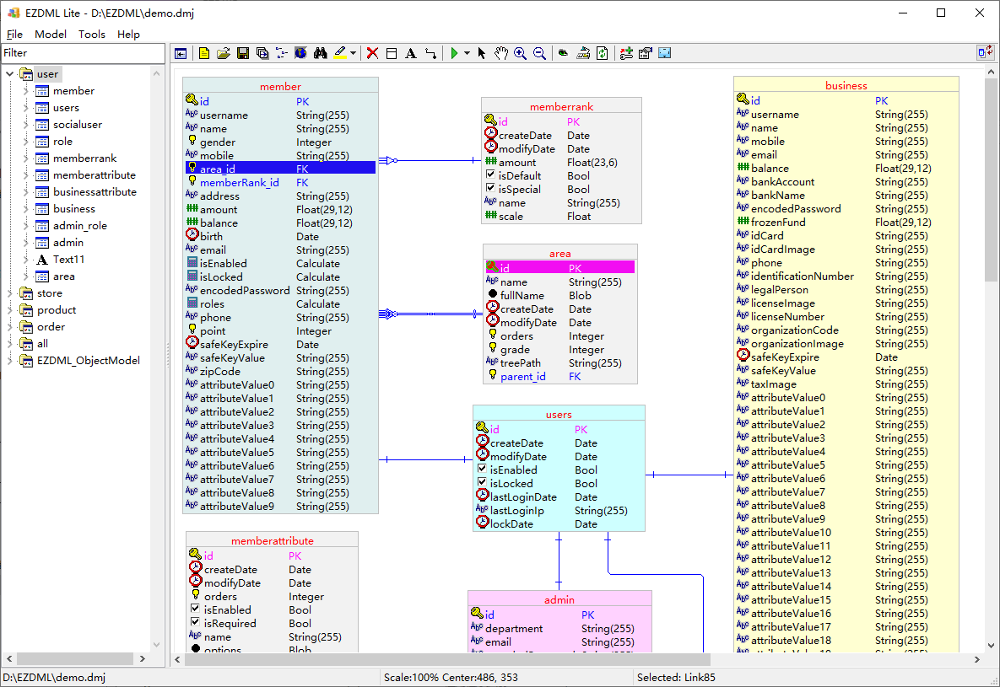

# EZDML Lite

#### Description

EZDML Lite is a small free tool which helps you to create data models quickly. It's simple and fast, with EZDML you can create tables within few seconds.

Features:
1. Table model design: create table, fields, primary key, foreign key and comments
2. Text script to create models quickly
3. Diagram layout with logical and physical model views
4. Import exists tables from database (ORACLE, MYSQL, SQLSERVER, SQLITE, POSTGRESQL, ODBC, JDBC, HIVE)
5. Generate database DDL SQLs, compare with exists object to genarate proper SQLs.

Note: This repository is a Lite version of EZDML with all source units required, which can be easily compiled on Windows, Linux, and Mac OS. You may also try EZDML_ord branch if you want a fully functional version.

Sites:
http://www.ezdml.com

https://gitee.com/huzgd/ezdml

https://github.com/huzgd/ezdml

#### Architecture

- Borland Delphi Pascal
- Free Pascal, www.freepascal.org
- Lazarus, lazarus.freepascal.org
- uJSON, Jose Fabio Nascimento de Almeida
- FCL SqlDB

#### Instructions

1.  Download and install Lazarus+FPC from lazarus-ide.org, version required: Lazarus 2.0+
    -  https://www.lazarus-ide.org/
    -  Choose the appropriate installer for your platform (Windows/Linux/MacOS)
2.  Clone the repository to local disk
3.  Open ezdml_lite.lpi with Lazarus and compile/run

#### Notes

1.  The repository already contains all the required source code, which can be compiled and run on Windows, Linux, and MacOS
2.  The core classes and data format of EZDML Lite are completely consistent with the official version, but do not include some extended advanced features such as pascal/java script engine, user interface design/preview, Excel import, Pdm import, ChatGPT generation, batch code generation, and test data generation. Some details of data processing differ from the official version
3.  No installation program provided. It is recommended to make package base on the official green version (rename and replace the EZDML executable), which locations here: https://gitee.com/huzgd/ezdml_green

#### Download EZDML

http://www.ezdml.com/download_en.html

https://gitee.com/huzgd/ezdml/releases

https://pan.baidu.com/s/1HI3EQ4n-Lb5Y2s1poNTujA?pwd=8wj2

#### Contact

huzzz@163.com

http://www.ezdml.com

QQ group: 344282607

#### Version history of EZDML:

2009-2-18 V1.21
This tool project started from Apr 2006, so version number is 1.2 now

2009-2-22 V1.22
Some precision bugs fixed

2009-6-5 V1.23
Improvements of importing, exporting, foreign link. Support new data types: objects, functions and events.

2009-7-15 V1.24
Index creating bug fixed. Auto deal with long index name. Check hint for invalid field names.

2009-8-29 V1.30
Support SQLSERVER and ODBC driver. Support for multi diagram. C++ code generation.

2009-9-12 V1.32
Generate DML and DQL SQL. Import and export table comments. Add foreign key in diagram. Remember database connection info. Bugs fixed. Support for english

2009-9-25 V1.34
Model diagram color style settings, copy image to clipboard, bugs fixed.

2009-10-11 V1.35
Big application icon, use English by default.

2009-10-21 V1.36
Bugs of importing database object fixed.

2009-11-8 V1.40
Support for MYSQL, some bugs fixed.

2009-11-25 V1.42, 2009-11-29 V1.50
Export to excel, some improvements and bugs fixed.

2009-12-19 V1.52
Bugs fixed.

2010-4-20 V1.55
Support Pascal-Script-Templates, bugs fixed.

2010-9-6 V1.59
Pascal-Script with Setting-Panel, bugs fixed.

2010-12-1 V1.62
Search and import fields from exists table. bugs fixed.

2010-12-20 V1.63
Support auto-increment fields for MySql and SQLServer.

2011-3-15 V1.64
Drag and drop to open a file, recent file list.

2011-4-7 V1.71
Support field comments for SQLServer, fully support for SQLServer2005, bugs fixed.

2011-4-23 V1.77
Batch add or import fields to more than one table, generate indexes SQL for FK fields, bugs of importing ORACLE indexes fixed.

2011-5-1 V1.79
Color settings for PK and Lines, and scroll bars for model graph.

2011-5-15 V1.80
Backup and restore data rows between ORACLE and SQLServer.

2011-6-8 V1.81
Support batch add/remove fields in popup-menu of the table tree. Bugs fixed.

2011-7-17 V1.82
Text script support new format like "CusNam NameOfCustomer S(100)". Bugs fixed.

2011-7-25 V1.85
Support ORACLE connections with NSDOA (BA-Platform-Data-Service). Bugs fixed.

2011-9-16 V1.88
Support text or sql entities. Bugs fixed.

2011-10-16 V1.91
Support overview mode.

2011-11-02 V1.92
Add a SQL tool.

2012-10-20 V1.95
Add html form generator, bugs fixed.

2012-10-28 V1.96
Support multi primary keys, generate with selection, bugs fixed.

2014-04-27 V1.97
Auto save & load on exit & start, some other improvements and bugs fixed.

2014-09-29 V1.98
Specail copy, multi entity color, pascal script with template support (like JSP and ASP).

2014-12-07 V1.99
Auto-save, Custom field type list, Custom field type replacements, bugs fixed.

2015-02-09 V2.01
Default field type customize, Sync same name tables, Both logic and physics name mode, bugs fixed.

2015-04-15 V2.02
Support oralce instant-client, generate sql without db-connection, check file date before fast-loading of tmp file, bugs fixed.

2015-09-07 V2.03
Bugs fixed.

2015-10-11 V2.04
Support Sqlite, bugs fixed.

2015-10-19 V2.06
Support PostgreSQL, support Global-Script-Events to generate customized SQL, save db password, bugs fixed.

2015-12-26 V2.11
Export doc and mht with graph UI and code, support UTF-8 charset for ORACLE, bugs fixed.

2016-05-15 V2.13
Prompt if files opened twice, link line auto align, INI switch for ORACLE sequence, New-table template file, paste field prop from excel, bugs fixed.

2017-03-23 V2.14
Gen recreate table sql. Bugs fixed.

2017-08-05 V2.15
Support FK for PK fields, comparing with another EZDML modal to generate SQLs. Bugs fixed.

2018-01-18 V2.16
Create new table on mouse position. Copy image as PNG by default (hold SHIFT for WMF). Export BMP PNG and JPG files. Save temporary files to user TEMP folder and keep history files. Bugs fixed.

2018-09-02 V2.17
Batch generation of code files. Bugs fixed.

2018-11-04 V2.18
Supports selecting fields, copying names and double-clicking to edit fields directly on the model graph, holding ALT to pan the model graph at any time, pressing ALT and click on the left tree to locate the table directly in the model graph. Bugs fixed.

2018-12-16 V2.20
Add constraint to Table-Describe-String, support table-data-preview, generate beeline for links, support include {$I file} for Pascal-Script, support custom tool-menus. Bugs fixed.

2019-04-27 V2.21
Support JSON format, dmh and dmj format modified. Bugs fixed.

2019-07-20 V2.22
Database logon histories, auto recognizes one-to-one FK links, describe text support FKs, custom reserved-keywords, demo files. Bugs fixed.

2019-08-27 V2.23
Detect file changes, FK-line optimize, new libpq.dll, sort tables by name, Bugs fixed.

2019-10-07 V2.32
Custom property UI for tables and fields (edit INI to enable), add TIniFile and CurField for scripts, support JavaScript (BESEN engine), improved auto-arrange algorithms, use ActionList in main form. Bugs fixed.
                
2019-11-09 V2.35
Drag and drop tree-nodes to copy fields/tables. Auto save for scripts. Bugs fixed.
                      
2019-12-07 V2.36
Independent configuration files for English and Chinese, Sketch-Mode for generating SQL. Bugs fixed.

2020-01-23 V2.39
Optimization of automatic routing algorithm, performance optimization for huge file, import pdm files. Bugs fixed.

2020-01-31 V2.41
Auto pan when selecting. Support none-FK-lines. Camel-case conver to underline. UTF-8 encoding for data files. Bugs fixed.

2020-01-31 V0.01
EZDML Lite version started.

2020-03-15 V0.11
EZDML for mac64/linux64/win64 v0.11 released.

2020-04-11 V3.01
New Settings and About dialog, global event scripts enabled, new app icon, bugs fixed.

2020-05-10 V3.03
Add ODBC connection, new postgreSQL lib files, bugs fixed.

2020-10-18 V3.04
Multi-view-mode for table dialogs, find text in describe-text, horz-layout for script editor, PKInc type. Bugs fixed.

2020-11-22 V3.05
Switch-view-mode for table dialogs, add layuiAdmin template for Code-generation. Bugs fixed.

2021-02-16 V3.06
HTTP remote connection, add JDBC server. Search all tables/fields. Bugs fixed.

2021-03-27 V3.07
Display field properties beside field-list. Independent position for overview-mode. Bugs fixed.

2021-04-24 V3.08
Auto check updates, view table props of database, support complex indexes and bigint/smallint data types. Bugs fixed.

2021-05-30 V3.09
Full-screen mode. Bugs fixed.

2021-10-23 V3.11
Highlight relate fields of selected FK-links, HTTP_JDBC connection, F9 to toggle Table view quickly. Bugs fixed.

2021-11-02 V3.12
Copy & paste Excel text. Bugs fixed.

2021-12-18 V3.21
UI preview and demo data generate, new Calculate data-type, improvements of field props. Bugs fixed.

2021-12-25 V3.22
Generate markdown text, customizing of table Generate tabs. Bugs fixed.

2022-01-02 V3.23
Generate Vue-ElementUI and Baidu-amis page. Run code generation, new layuiAdmin demo (with VueElement, BaiduAmis, Markdown, etc). Bugs fixed.

2022-01-15 V3.24
Python script demo, generate .vue file and preview, table advanced props. Bugs fixed.

2022-02-06 V3.25
Add UI page to table prop, create field while adding new link. Bugs fixed.

2022-02-13 V3.26
Generate runnable code for vue-element-admin template (NodeJs needed). Bugs fixed.

2022-02-27 V3.27
Generate runnable code for SpringBoot-JPA-swagger2-lombok template (JDK8 & maven needed). Bugs fixed.

2022-03-03 V3.28
Create FK-links by popup-menu. Bugs fixed.

2022-03-11 V3.29
Copy & paste in fields-list. Bugs fixed.

2022-03-19 V3.31
Show/hide left tree (F11), use keyboard to traverse graph objects (Ctrl+Arrow), retrieves test data rule from database (SQL). Bugs fixed.

2022-03-27 V3.32
Generate runnable code for Erupt template (JDK8 & maven needed). Bugs fixed.

2022-04-09 V3.33
Toggle UI shape(PC/Pad/Phone). Bugs fixed.

2022-04-17 V3.35
Add relation-map to table properties dialog, simplify UI and hide extended properties by default. Bugs fixed.

2022-05-01 V3.36
Generate test data insert SQLs, improved SQL tool. Bugs fixed.

2022-05-07 V3.37
Improvements of Erupt code generation. Bugs fixed.

2022-05-22 V3.38
Save/load model files to/from database. Bugs fixed.

2022-06-04 V3.39
Copy relate-query/join/insert SQLs. Bugs fixed.

2022-06-18 V3.41
Auto-capitalize with new probability-dict, Chinese word segment. Bugs fixed.

2022-07-30 V3.42
Support importing and generating HIVE database, and creating many-to-many relation table. Bugs fixed.

2022-09-24 V3.43
Batch import from excel content, single record sheet for SQL editor. Bugs fixed.

2022-10-15 V3.45
Automatically notify other users of updates after modifying database files. Bugs fixed.

2022-11-06 V3.46
Improvements of UI design notes. Bugs fixed.

2022-11-13 V3.47
Bugs fixed.

2022-12-03 V3.48
Optimize SQL query tool. Bugs fixed.

2023-02-12 V3.51
Support ChatGPT. Bugs fixed.

2023-03-26 V3.52
Add field weight settings. Bugs fixed.

2023-06-23 V3.54
Supports dragging entity grips to change size. Bugs fixed.

2023-07-23 V3.55
Remember the view position of the model diagram. Bugs fixed.

2023-12-02 V3.56
SQL tools support automatic completion (. to dropdown field list) and simple SQL formatting, model diagrams support double foreign key and self relate links. Bugs fixed.

2024-02-24 V3.57
Add group box, enable ODBC connection for ORACLE/MYSQL/POSTGRE, view diagrams in new window, optimize SQL query tool. Bugs fixed.

2024-04-20 V3.58
Lock/unlock database files, handling charset issue of ODBC. Bugs fixed.

2024-05-26 V3.59
Locate last model when opening file. JDBC connection for ORACLE/MYSQL/POSTGRE/SQLSERVER. Bugs fixed.
